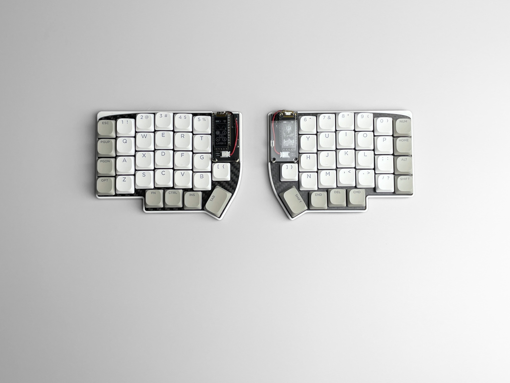
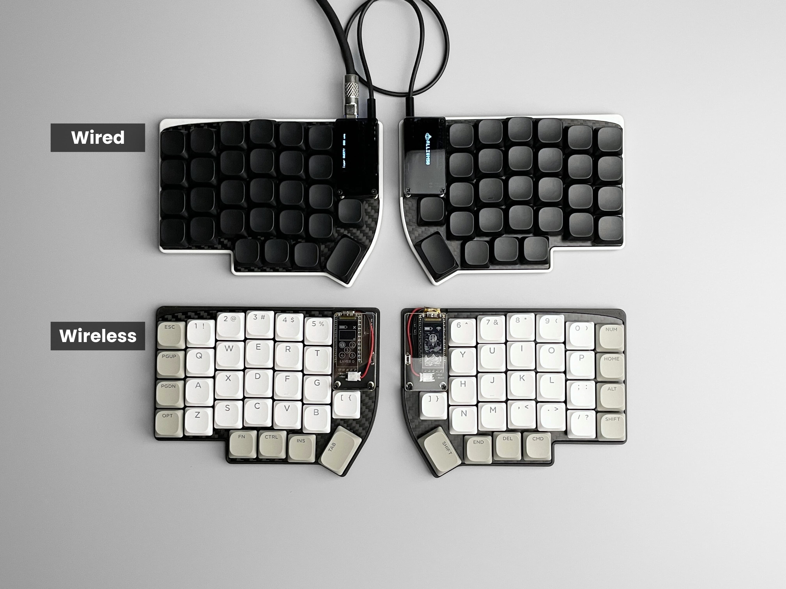
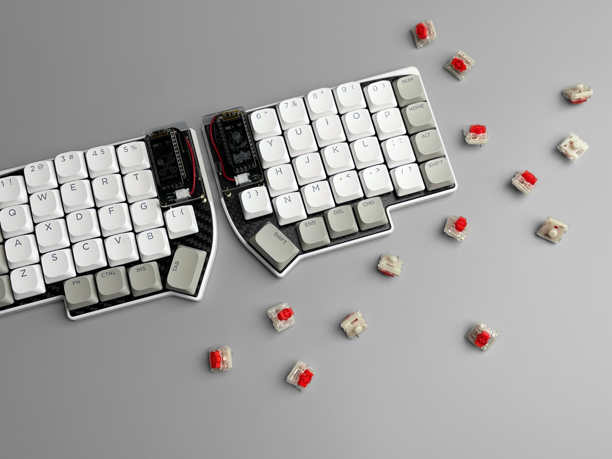
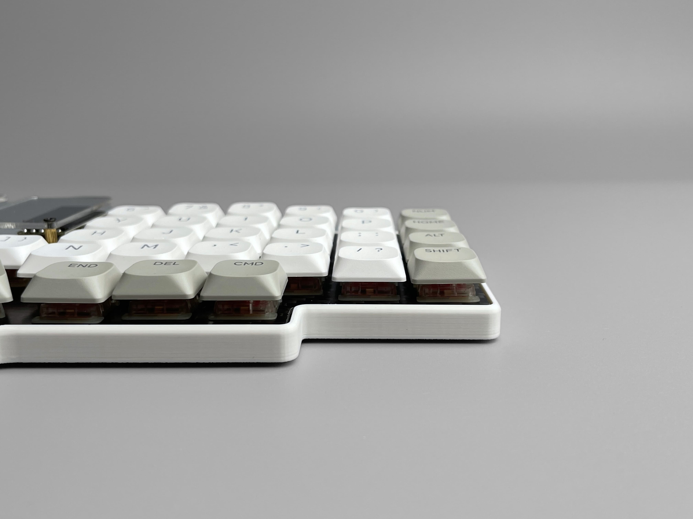

# Allium58

The Allium58 is an open source 6*4+4keys column-staggered split keyboard. It is based on [Lily58 Pro created by kata0510](https://github.com/kata0510/Lily58/tree/master/Pro). The Allium58 shares the same layout as the Lily58 Pro and also supports using the original Lily58 Pro firmware. However, several changes have been made to the board:

- **Enhanced Wireless Capability:** The Allium58 is designed to be more suitable for wireless builds. It provides native support for utilizing power-saving nice!view or other memory-in-pixel displays. This allows for efficient power management and extended battery life.

- **Improved Battery Management:** To enhance battery management, power switches and JST battery sockets have been added to the Allium58. These additions make it easier to control power supply and facilitate seamless battery replacement.

- **GLP (Gateron Low Profile) Socket Compatibility:** A variant of Allium58 that works with Gateron Low Profile sockets. This allows for the use of Gateron KS-27/KS-33 low-profile key switches.

## Status

| Variant  | Status  |
| ------------ | ------------ |
| GLP (Gateron Low Profile) | Ready  |
| MX & Choc  | WIP  |

## Photos

## Bill of Materials (BOM)

### Required

| Name | Count | Remarks |
|:-|:-|:-|
| PCB | 1 set | |
| Top plate | 2 sheets | 1.2mm thick |
| Bottom plate / 3D printed case | 1 set | |
| OLED cover | 2 | |
| Pro Micro (compatible with Sea Picro RP2040) / nice!nano or equivalent | 2 |  |
| Reset button | 2 | TS-1136 THT |
| Diodes | 58 | SMD Only (SOD-123 Package) |
| Hotswap Sockets | 58 | [GLP variant] Gateron Low Profile Hotswap Sockets |
| Key switches | 58 | [GLP variant] Gateron KS-33 / KS-27 |
| Keycaps | 58 pieces | 1u 56 pcs, 1.5u 2 pcs [GLP Keycaps Comparison](https://showcase.beekeeb.com/the-keycaps-of-gateron-low-profile-key-switches-and-kailh-choc-v1-key-switch/) |
| Female Threaded Brass Spacer M2 5mm | 10 pieces | For Case assembly |
| Female Threaded Brass Spacer M2 9mm (or 14mm with MCU sockets) | 4 pieces | For OLED cover |
| GP823 Screw M2 4mm | 28 screws | |
| [Wired build] TRRS (4 poles) cable | 1 |  |
| [Wired build] TRRS jack | 2 |  |
| [Wired build] Micro USB or USB-C cable | 1 | Avoid charge-only cables |
| [Wireless build] JST battery socket | 2 | |
| [Wireless build] Battery with JST connector | 2 | |
| [Wireless build] Battery / power switch | 2 | IS-1290A-W-G / MSK12C02 / SSSS811101 |

### Optional

| Name | Count | Remarks |
|:-|:-|:-|
| OLED module / nice!view display | 2 | |
| Microcontroller / OLED Sockets & Pins | 1 set |  |

## Case
- Top Plate & Low Profile Bottom Case: https://www.printables.com/model/657755-low-profile-case-for-allium58-glp

## Firmware

- Wired: [QMK](https://github.com/qmk/qmk_firmware "QMK") - compatible with `lily58/rev1`
- Wired: [Vial](https://github.com/vial-kb/vial-qmk "Vial") (based on QMK) - supported
- Wireless: [ZMK](https://github.com/zmkfirmware/zmk "ZMK") - supported

## Ordering Parts

- Wired: https://shop.beekeeb.com/product/allium58-glp-wired-kit/
- Wireless: https://shop.beekeeb.com/product/allium58-glp-wireless-kit/

## External Libraries

* [https://github.com/siderakb/key-switches.pretty](https://github.com/siderakb/key-switches.pretty)
* [https://github.com/foostan/kbd](https://github.com/foostan/kbd)

## More Information

* [A great doc about Gateron Low Profile switches writen by Rafael Yumagulov](https://ergonautkb.github.io/docs/switches/gateron-low-profile/)
* [Keycaps for Gateron Low Profile Key Switches](https://showcase.beekeeb.com/the-keycaps-of-gateron-low-profile-key-switches-and-kailh-choc-v1-key-switch/)

## Credits

This open source hardware project is created by [beekeeb](https://beekeeb.shop) and other contributors. It is based on [Lily58 Pro created by kata0510](https://github.com/kata0510/Lily58/tree/master/Pro).

